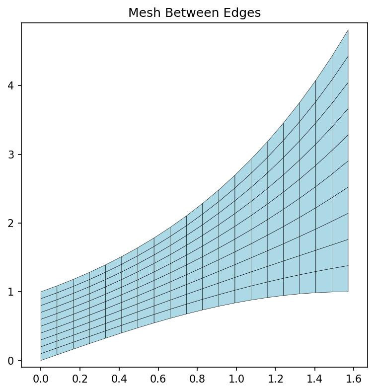
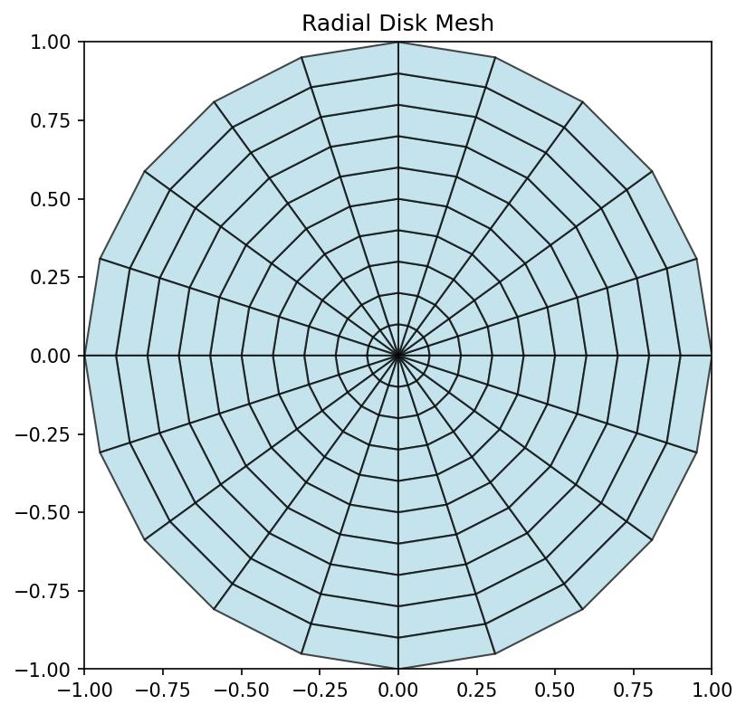
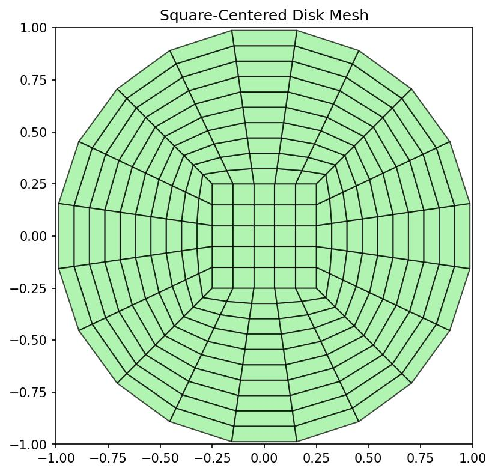
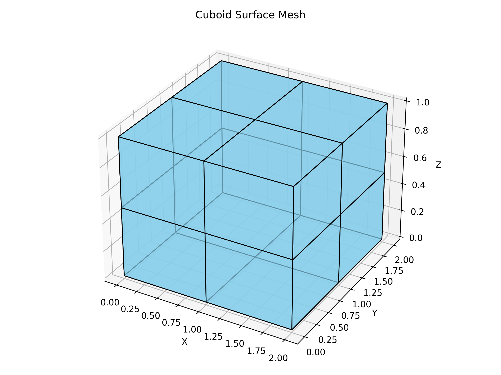
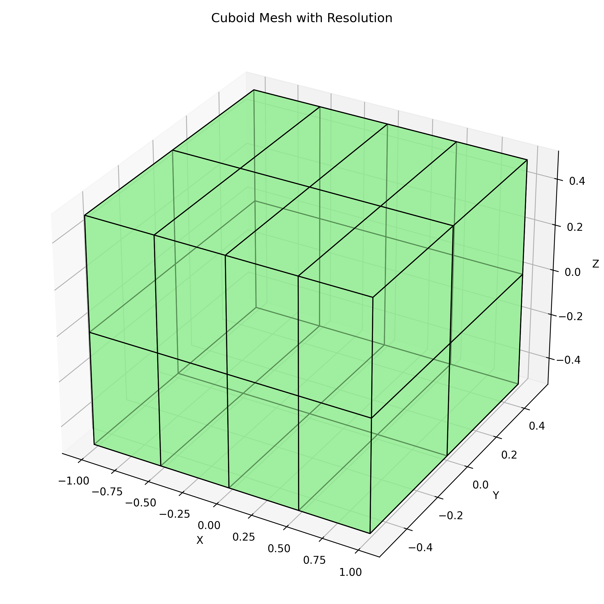

# 🧱 Surface Mesher

[](https://github.com/ckesanapalli/surface-mesher/actions/workflows/python-package.yml/badge.svg)
[](https://coveralls.io/github/ckesanapalli/surface-mesher?branch=master)
[](LICENSE.txt)
[](https://www.python.org/downloads/)

**Surface Mesher** is a Python library for generating structured 3D surface meshes of primitive shapes, with a strong focus on **quadrilateral-dominant (quad) meshing**. The meshes are particularly suited for **visualization** and **Boundary Element Method (BEM)** simulations.

> ⚠️ This project is currently under active development.

---

## ✨ Features

- Generate clean, structured **cuboid surface meshes**
- Support for mesh generation using:
  - Fixed number of divisions
  - Fixed edge sizes
  - Explicit coordinate arrays
- All mesh faces are quadrilateral with consistent vertex ordering
- Easily visualized using `matplotlib` 3D plotting
- Lightweight and dependency-minimal core

---

## 🎯 Objective

This library aims to provide a minimal, intuitive interface for constructing **quad-based surface meshes** of primitive solids.

Use cases include:

- Geometry visualization
- Boundary Element Methods (BEM)
- Educational tooling
- Preprocessing for surface-based solvers

---

## ⚙️ Requirements

- **Python**: >= 3.10
- **Dependencies**:
  - `numpy>=1.24`
  - Optional (for examples and visualization):
    - `ipykernel`
    - `jupyterlab`
    - `matplotlib`

---

## 🚀 Installation

You can install the latest development version via Git:

```bash
pip install git+https://github.com/ckesanapalli/surface-mesher.git
```

---

## 🧱 Basic Usage

Below are examples of how to use the library to generate and visualize meshes.

### 1. Generate a Mesh Between Two Edges

```python
import numpy as np
from surface_mesher import mesh_between_edges

# Define two edges
x = np.linspace(0, np.pi / 2, 20)
edge1 = np.array([x, np.sin(x)])
edge2 = np.array([x, np.exp(x)])

# Generate the mesh
radial_resolution = 10
mesh = mesh_between_edges([edge1, edge2], radial_resolution)

print(f"Generated mesh with {mesh.shape[0]} quadrilateral faces.")
```

**Visualization:**


---

### 2. Generate a Radial Disk Mesh

```python
from surface_mesher import disk_mesh_radial

# Parameters for the radial disk mesh
radius = 1.0
radial_resolution = 10
segment_resolution = 20

# Generate the radial disk mesh
radial_mesh = disk_mesh_radial(radius, radial_resolution, segment_resolution)

print(f"Generated radial disk mesh with {radial_mesh.shape[0]} quadrilateral faces.")
```

**Visualization:**


---

### 3. Generate a Disk Mesh with a Square Core

```python
from surface_mesher import disk_mesh_square_centered

# Parameters for the square-centered disk mesh
radius = 1.0
square_resolution = 5
radial_resolution = 10
square_side_radius_ratio = 0.5

# Generate the square-centered disk mesh
square_centered_mesh = disk_mesh_square_centered(
    radius, square_resolution, radial_resolution, square_side_radius_ratio
)

print(f"Generated square-centered disk mesh with {square_centered_mesh.shape[0]} quadrilateral faces.")
```

**Visualization:**


---

### 4. Generate a Cuboid Mesh using Explicit Coordinates

```python
from surface_mesher import cuboid_mesh

# Define coordinate arrays for a cuboid
x_coords = [0.0, 1.0, 2.0]
y_coords = [0.0, 1.0, 2.0]
z_coords = [0.0, 0.5, 1.0]

# Generate the cuboid surface mesh
faces = cuboid_mesh(x_coords, y_coords, z_coords)

print(f"Generated {faces.shape[0]} quadrilateral faces.")
```

**Visualization:**


---

### 5. Generate a Cuboid Mesh using Resolution

```python
from surface_mesher import cuboid_mesh_with_resolution

# Parameters for the cuboid mesh
length, width, height = 2.0, 1.0, 1.0
resolution = (4, 2, 2)

# Generate the cuboid mesh
mesh = cuboid_mesh_with_resolution(length, width, height, resolution=resolution)

print(f"Generated cuboid with {mesh.shape[0]} quadrilateral faces.")
```

**Visualization:**


---

For more detailed examples and visualizations, refer to the [example notebooks](examples/).

---

## 📌 Roadmap

- [x] Cuboid surface mesh generation
- [x] Disk face mesh generation
- [ ] Cylinder, cone, and sphere support
- [ ] Curvilinear mesh
- [ ] STL/PLY export support
- [ ] Mesh visualization utilities
- [ ] Export to BEM-compatible formats

---

## 📄 License

MIT License © 2025 Chaitanya Kesanapalli
